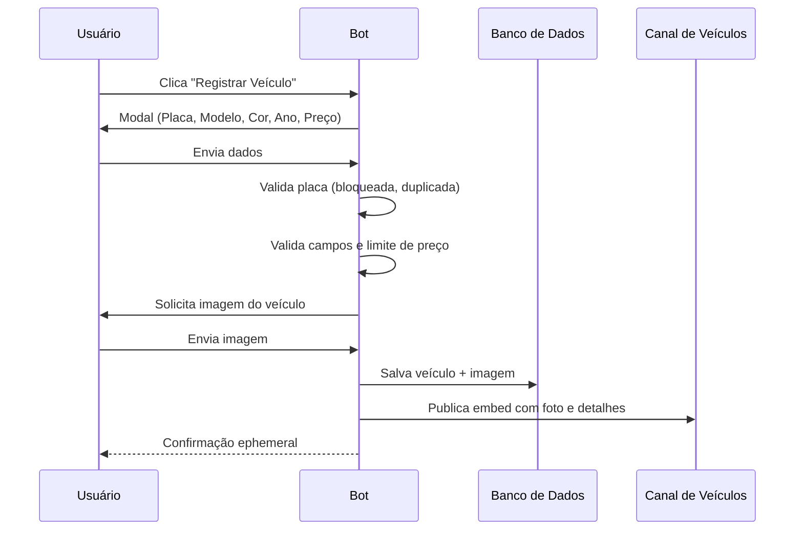

<p align="center">
  
</p>

<p align="center">
  
  
  
  
  
</p>

<br>

<h1 align="center"> 𝚅𝚎𝚑𝚒𝚡 • 𝙱𝙾𝚃</h1>

<p align="center">
  Sistema profissional de registro de veículos com validação de dados, moderação de placas e backup automático.
</p>

<p align="center">
  <b>𝙼𝚊𝚍𝚎 𝙱𝚢 𝚈𝟸𝚔_𝙽𝚊𝚝</b>
</p>

---

## ✦ 𝙰𝙱𝙾𝚄𝚃

> O **Vehix** é um sistema de registro de veículos desenvolvido em **Node.js + discord.js v14**, ideal para servidores de roleplay ou concessionárias. Ele permite o cadastro de veículos com imagens, placa case sensitive, limite de preço, bloqueio de placas e muito mais.

---

## ✦ 𝙵𝙴𝙰𝚃𝚄𝚁𝙴𝚂

```txt
🚗 VEHICLE REGISTER  → Cadastro via modal + upload de imagem
🔠 CASE SENSITIVE     → Placas diferenciam maiúsculas e minúsculas
💰 PRICE LIMIT        → Máximo de $130.000 USD (configurável)
🚫 PLATE MODERATION   → Bloqueio/desbloqueio de placas por servidor
📊 STATISTICS         → Totais, modelos únicos, faixa de preço, ano
📁 BACKUP             → Automático a cada 24h com rotação de 7 dias
🧹 AUTO CLEANUP       → Remove registros antigos e órfãos automaticamente
📢 WEBHOOK            → Notificações de novos registros e eventos
📋 PAGINATED LIST     → Lista de veículos com botões de navegação
🔍 SEARCH             → Busca por placa ou ID com embed detalhado
```

---

✦ 𝚂𝚈𝚂𝚃𝙴𝙼 𝙵𝙻𝙾𝚆



---

## ✦ 𝘾𝙊𝙈𝙈𝘼𝙉𝘿𝙎

### 🤖 Slash (Owner)

| Comando | Descrição |
|---------|-----------|
| `/register #canal` | Define o canal onde o botão de registro aparece |
| `/registered #canal` | Define o canal onde os veículos registrados são publicados |

---

### 📋 Prefixo `'` (Owner)

| Comando | Descrição |
|---------|-----------|
| `'stats` | Estatísticas detalhadas do servidor |
| `'listvehicles` | Lista todos os veículos com paginação |
| `'searchvehicle <placa ou id>` | Busca veículo por placa ou ID |
| `'deletevehicle <id>` | Remove um veículo do sistema |
| `'exportdata` | Exporta todos os dados em JSON |
| `'backup criar` | Cria um backup manual |
| `'backup listar` | Lista backups disponíveis |
| `'restaurar <arquivo>` | Restaura um backup específico |
| `'blockplate <placa> [motivo]` | Bloqueia uma placa |
| `'unblockplate <placa>` | Desbloqueia uma placa |
| `'listblocked` | Lista todas as placas bloqueadas |
| `'cleanup users` | Remove veículos de usuários ausentes |
| `'cleanup old` | Remove veículos com +30 dias |
| `'cleanup orphan` | Remove veículos de servidores inexistentes |
| `'setwebhook <url>` | Configura webhook de notificações |
| `'broadcast <mensagem>` | Envia anúncio para todos os servidores |
| `'help` / `'ajuda` | Mostra a lista completa de comandos |
 
---

✦ 𝙋𝙀𝙍𝙈𝙄𝙎𝙎𝙄𝙊𝙉𝙎

👑 DONO DO BOT
✔ Slash commands de configuração
✔ Todos os comandos prefixados

👤 USUÁRIOS COMUNS
✔ Registrar veículos (via botão)

🚫 PLACAS BLOQUEADAS
✔ Impede novos registros com a placa
✔ Gerenciado apenas pelo dono

---

## ✦ 𝘿𝘼𝙏𝘼𝘽𝘼𝙎𝙀

| Arquivo / Pasta | Descrição |
|----------------|-----------|
| `data/guilds.json` | Configuração de canais por servidor |
| `data/vehicles.json` | Dados dos veículos registrados |
| `data/blocked_plates.json` | Placas bloqueadas por servidor |
| `data/webhook.json` | URL do webhook global |
| `backups/` | Backups automáticos (mantém os últimos 7 dias) |
| `logs/` | Logs diários do sistema |

---

✦ 𝙊𝘽𝙅𝙀𝘾𝙏𝙄𝙑𝙀

✔ Automatizar o registro de veículos
✔ Manter um histórico organizado
✔ Facilitar a busca e moderação
✔ Garantir integridade com validações

---

📌 Status

🟢 Online • ⚡ Estável • 🔒 Seguro

---

<p align="center">
  <b>© 2026 Vehix • 𝙼𝚊𝚍𝚎 𝙱𝚢 𝚈𝟸𝚔_𝙽𝚊𝚝</b>
</p>